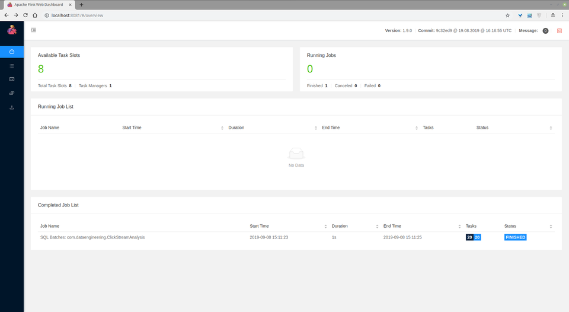

# Dockerize an Apache Flink Application using Docker and Docker-Compose

In this case, we used docker container technologies to launch Flink cluster and Flink App separately from scratch. 
Flink Cluster (Platform) consists of two different docker containers (jobmanager, taskmanager) that are already built in `docker-compose.flink.yml`.
Flink Application consists of one docker container that already using a dockerfile (`./app-flink-base/Dockerfile`) and a shell script (`./app-flink-base/run.sh`) to submit jar file to cluster in `docker-compose-app-flink.yml`.

# Problem
Please, note that we used [`Apache Flink Table & SQL APIs`](https://ci.apache.org/projects/flink/flink-docs-stable/dev/table/) to write the queries on `DataSet` rather than using [`Apache Flink DataSet APIs`](https://ci.apache.org/projects/flink/flink-docs-release-1.9/dev/batch/) .
The results of the queries will be dumbing into `./data/output` as q1, q2, q3, q4, q5, respectively. 

### Requirements
Please, note that you need to install compatible `docker` and `docker-compose` version before using the service.
You could see the version of `docker` and `docker-compose`, below.

#### docker version

        Client:
         Version:           18.06.1-ce
         API version:       1.38
         Go version:        go1.10.3
         Git commit:        e68fc7a
         Built:             Tue Aug 21 17:24:56 2018
         OS/Arch:           linux/amd64
         Experimental:      false
        
        Server:
         Engine:
          Version:          18.06.1-ce
          API version:      1.38 (minimum version 1.12)
          Go version:       go1.10.3
          Git commit:       e68fc7a
          Built:            Tue Aug 21 17:23:21 2018
          OS/Arch:          linux/amd64
          Experimental:     false

#### docker-compose version

    docker-compose version 1.22.0, build f46880fe
    docker-py version: 3.4.1
    CPython version: 3.6.6
    OpenSSL version: OpenSSL 1.1.0f  25 May 2017

#### make version

    GNU Make 4.1
    Built for x86_64-pc-linux-gnu
    Copyright (C) 1988-2014 Free Software Foundation, Inc.
    License GPLv3+: GNU GPL version 3 or later <http://gnu.org/licenses/gpl.html>
    This is free software: you are free to change and redistribute it.
    There is NO WARRANTY, to the extent permitted by law.

#### Apache Flink Version
        1.9.0
        
#### Java Version

       1.8.0
       
#### Scala Version

        2.11

You may look at pom.xml, docker-compose and docker files to get the further information about versioning of libs.

## Usage

1. Please, note that add your CSV file (**case.csv**) under `./data/input` directory.
2. You will find `makefile` to kick off the platform. It has three different commands to build, start, and stop platform.

* To build platform

        make build_platform
    
* To start platform

        make up_platform
    
* To stop platform

        make down_platform
        
3. Start Apache Flink app.

* To build application as a container

        make build_app
    
* To start application

        make up_app
    
* To stop application

        make down_app

* To build application without container (for development)

        make mvn_test
        make mvn_package

# Docker Services

### Flink App 

### Flink Job Manager and Task Manager

        http://localhost:8081
        

